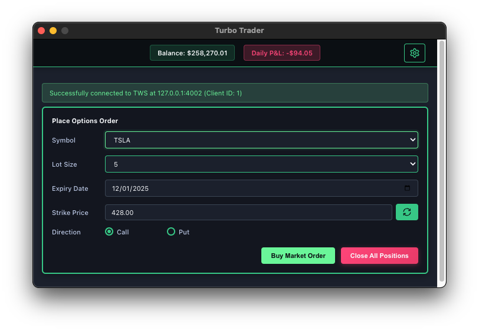
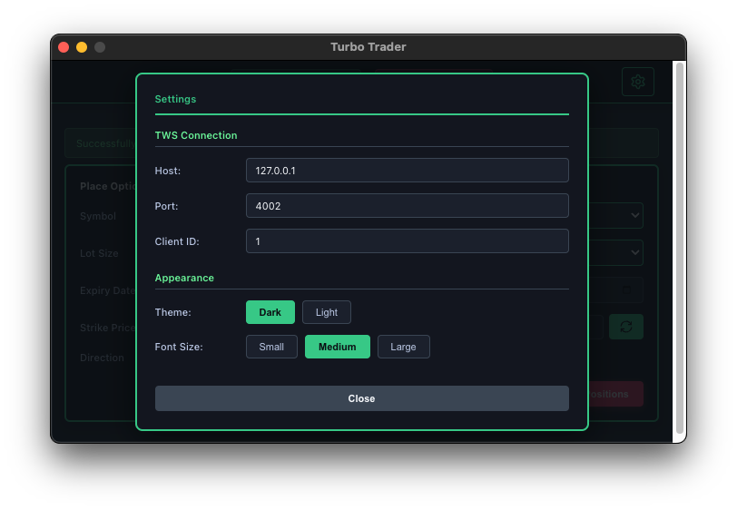
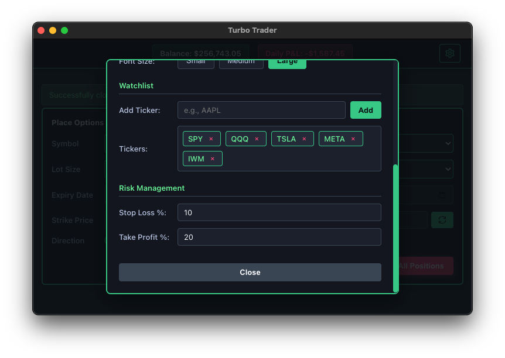

# Turbo Trader

A lightning-fast, cross-platform Electron-based application for connecting to Interactive Brokers TWS (Trader Workstation) or IB Gateway via Python API.







## Features

- 🖥️ Native macOS look and feel
- 🔌 Easy connection to TWS/IB Gateway
- 🐍 Python bridge for TWS API integration
- ✨ Clean and intuitive user interface
- ⚡ Real-time connection status feedback
- ⚙️ **Settings panel** with gear icon for easy configuration
- 🎨 **Dark/Light theme support** - Switch between themes instantly
- 🔤 **Adjustable font sizes** - Small, Medium, and Large options
- 💾 **Persistent connection settings** - Settings saved in `.env` file
- 💰 **Auto-populate Strike Price** - Automatically fetches current ticker price
- 🔄 **Refresh button** - Manually update strike price with latest market data
- 📊 Real-time portfolio balance and daily P&L tracking
- 📈 Options trading interface with Buy and Close All functionality
- 🛡️ **Stop Loss & Take Profit** - Automatic bracket orders based on fill price percentages

## Prerequisites

### 1. Node.js and npm
- **Version:** Node.js 16.x or higher
- **Download:** https://nodejs.org/

### 2. Python 3
- **Version:** Python 3.7 or higher

### 3. TWS Python API Library

Install either `ib_insync` (recommended) or `ibapi`:

```bash
pip3 install ib_insync
```

### 4. Interactive Brokers TWS or IB Gateway
- **Download TWS:** https://www.interactivebrokers.com/en/trading/tws.php
- **Download IB Gateway:** https://www.interactivebrokers.com/en/trading/ibgateway-latest.php

**Important:** Enable API connections in TWS/Gateway:
1. Open TWS or IB Gateway
2. Go to **File → Global Configuration → API → Settings**
3. Check **Enable ActiveX and Socket Clients**
4. Add `127.0.0.1` to **Trusted IP Addresses**
5. Note the **Socket Port** (default: 7496 for TWS paper trading)

## Installation

1. Clone or download this repository
2. Navigate to the project directory:
   ```bash
   cd turbo-trader
   ```
3. Install dependencies:
   ```bash
   npm install
   ```

## Running the Application

```bash
cd turbo-trader
source bin/activate
npm start
```

## Usage

### 1. Start TWS or IB Gateway
- Launch TWS or IB Gateway
- Log in to your account
- Ensure API connections are enabled

### 2. Configure Connection Settings

The application automatically connects on startup using settings from the `.env` file:
- **Host:** `127.0.0.1` (localhost)
- **Port:** `4002` (IB Gateway Live Trading default)
- **Client ID:** `1`

**To change settings:**
1. Click the **gear icon** (⚙️) in the top-right corner
2. Update Host, Port, or Client ID as needed
3. Changes are automatically saved to `.env` file
4. Click **Reconnect** when prompted to apply changes

**Common Ports:**
- `7496` - TWS Paper Trading
- `7497` - TWS Live Trading
- `4001` - IB Gateway Paper Trading
- `4002` - IB Gateway Live Trading

### 3. Customize Appearance

In the Settings panel, you can:
- **Theme:** Switch between Dark and Light modes
- **Font Size:** Choose Small, Medium, or Large text

### 4. Trading Features

**Auto-populate Strike Price:**
- Select a ticker symbol
- The app automatically fetches and populates the current market price
- Click the refresh button (🔄) to update the price manually

**Place Orders:**
- Enter ticker, quantity, expiry date, and strike price
- Select Call or Put option type
- Click Buy to place the order

**Monitor Portfolio:**
- View real-time balance and daily P&L in the header
- Track your positions and performance

### 5. Risk Management (Stop Loss & Take Profit)

**Configure Protection:**
1. Open Settings (⚙️ gear icon)
2. Scroll to the **Risk Management** section
3. Set **Stop Loss %** (e.g., `10` for 10% below fill price)
4. Set **Take Profit %** (e.g., `20` for 20% above fill price)
5. Use `--` to disable either or both

**How It Works:**
- When you place a market order with SL/TP configured:
  - Parent order fills at market price
  - Stop Loss order automatically placed at `fillPrice × (1 - stopLoss%/100)`
  - Take Profit order automatically placed at `fillPrice × (1 + takeProfit%/100)`
  - Prices rounded to valid tick increments ($0.05 or $0.10)

**Example:**
- Order fills at **$3.00**
- Stop Loss 20% → Stop order placed at **$2.40**
- Take Profit 30% → Limit order placed at **$3.90**

**Notes:**
- Both settings are optional - you can use just Stop Loss, just Take Profit, or both
- Settings persist across sessions
- Bracket orders appear in TWS immediately after parent order fills
- When both are `--`, regular market orders are placed (no bracket)

## Troubleshooting

### Connection Issues

If connection fails, verify:
1. ✅ TWS/IB Gateway is running
2. ✅ API connections are enabled in settings
3. ✅ Correct port number is used
4. ✅ No other application is using the same Client ID
5. ✅ Python TWS API is installed (`pip3 install ib_insync`)

### Common Errors

**"Connection timeout"**
- Verify TWS/IB Gateway is running
- Check if API connections are enabled
- Confirm the correct port number

**"Client ID already in use"**
- Use a different Client ID in the app
- Close other applications using the same Client ID
- Restart TWS/IB Gateway

## License

MIT License

---

**Happy Trading! 📈**
